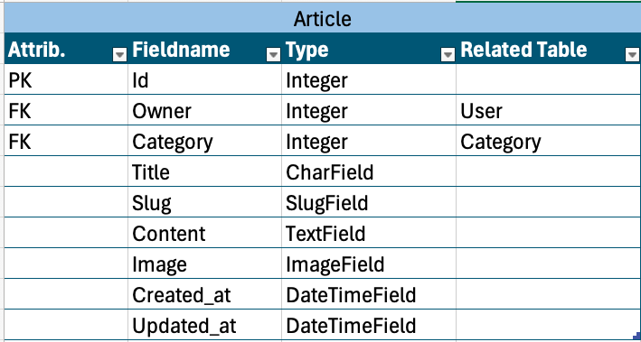

  
 

# Tech-Roadmap-DRF,

Tech-ROADMAP-DRF is a robust backend API built using Django with Django Rest Framework (DRF), designed to guide individuals who are eager to dive into the world of Information Technology (IT) but are unsure of where to start. Leveraging the power of Django's scalable architecture and the flexibility of DRF, this project serves as a comprehensive platform for delivering structured content, personalized learning paths, and community-driven resources to users.

The primary purpose of Tech-ROADMAP-DRF is to demystify the IT landscape for newcomers by offering a centralized hub of knowledge and guidance. Through a carefully curated collection of articles, courses.

With Tech-ROADMAP-DRF, users can navigate the often overwhelming array of IT disciplines—whether it's programming, cybersecurity, data science, or cloud computing—and find a clear, structured path to follow. By offering personalized course recommendations based on user preferences and progress, the project aims to create a tailored learning experience that empowers individuals to confidently embark on their IT journey.

In essence, Tech-ROADMAP-DRF harnesses the capabilities of Django and DRF to create a user-friendly backend system that not only delivers content but also fosters an interactive and supportive learning environment, making it an invaluable tool for aspiring IT professionals.

- [Tech-Roadmap-DRF,](#tech-roadmap-drf-)
- [Table of content](#table-of-content)
- [Planning](#planning)
- [Data Models](#data-models)
  * [ERD Diagram](#erd-diagram)
  * [Entitiy and Realtions](#entitiy-and-realtions)
- [API Endpoints](#api-endpoints)
- [Frameworks, Libraries and Dependencies](#frameworks--libraries-and-dependencies)
- [Testing](#testing)
  * [Manuel Testing](#manuel-testing)
  * [Python Validation](#python-validation)
  * [Bugs](#bugs)
    + [Unresolved Bugs](#unresolved-bugs)
    + [Resolved Bugs](#resolved-bugs)
- [Deployment](#deployment)
- [Credits](#credits)

<small><i><a href='http://ecotrust-canada.github.io/markdown-toc/'>Table of contents generated with markdown-toc</a></i></small>

# Planning

## Objectives

1. **Provide a Comprehensive IT Learning Platform**: Create a centralized resource that offers diverse IT-related articles.

2. **Enable Personalized Learning Paths**: Develop a system that recommends specialized courses and content targeting users' interests, experience levels to draw future career paths.

3. **Facilitate User Interaction and Engagement**: Implement features that allow users to comment, review, and rate content.

4. **Promote Knowledge Sharing**: Encourage users to contribute their insights, experiences, and feedback, enriching the platform with community-driven content and discussions.

5. **Ensure Secure User Authentication**: Implement a secure authentication system to an account which belongs to a certain user data and provide a personalized experience based on user profiles.

6. **Integrate Social Features**: Allow users to follow others, create connections , and build a network that supports collaborative learning.

7. **Optimize for Scalability and Performance**: Ensure the API is designed for high performance and scalability to accommodate a growing user base and expanding content library.

8. **Provide Comprehensive Documentation and API Support**: Offer detailed documentation for the API, making it easy for developers to integrate, extend, and contribute to the project.

## Allocated Time for Django Rest API

When I first come to the idea why should I develope an API tha is only accessible for the Admins, I didn't get the point clear enough that the API is just like a blue print which can be used to build different front end website based on the endpoints offered by this API. Developing an API that is accessible for Front-End Website is a game changer and that is why I tool some time to paln and implement the API using a walkthrough project by Code Institute 

**Coding the Backend DRF took me about 12 days WITHOUT README**

the **Timeline** looks like the following:

Day 1 : Intitialising the project on GitHub using the [procvided Code Institue template](https://github.com/Code-Institute-Org/ci-full-template) provided. Cloning the Project on the Visual Studio IDE locally and set up environment variables.

Day 2: Designing the Database in its primary structure and required entities. Models shown in this project are designed on [Qucik Database Diagram](https://app.quickdatabasediagrams.com/#/d/qGYihO)

Day 3: Normalising the Relationship between the different entities any models. 

Day 4 till Day 10: This period is the coding time where I used the Code Institue walkthrough project to tailor my project. Afterwards, I did add more models to my project which will enhance the user experience about the exapnding and extending the project. The new modesl like (Category, Course, Review and Rating) are coded to target users who want not just to read, comment and review the available articles but instead take them a step further to choose a course and go for it. If the course provided helped them, they will be able to write their review and rate it. It helps other users to make decision better on the experience of other participants. It is also worth mentioning that during the coding stage I make a use of new skills gained from the walkthrough project. Refactoring the code is one of the main and major skills to reduce the amount of code and reaching the same final result. Finally, I applied the filter mechanism to some of the models and left someother to be like a future feature when other programmers will deploy this API and make some changes to their cloned copy of this API. 

Day 11 and day 12: Deployment on Heroku Platform: preparing the project when it is API requires migrating the Database which is designed and implementing locally using SQLite. I took the following steps:

1. Updainting the ALLOWED_HOSTS variable.
2. Moving sensitive data to env.py
3. Installing extra packages for authentication
4. Installing the TOKEN packages
5. Editing the settings.py file with TOKEN varibales
6. Editing the urls.py file of the root project
7. Freezing the dependencies into the requirement.txt file
8. Creating the PocFile which is required on the HEROKU Platform
9. Creating the Database on PostGRES and link it into the project settings.py file
10. Setting a new App on Heroku Platform
11. Link the App Source to GitHub
12. Creating the Varibale from the env.py on HEROKU 
13. Manuelly deploying the project.

**Deployment on Heroku** will be explained in a later section

**Writing the README** starts after deployment of this API which is not recommend because it would be tedious work, though it presents a big and complete project to explain and dive into its details.

# Data Models

In the Tech-ROADMAP-DRF API, the architecture is built around several interconnected models that collectively form the backbone of the platform. These models are designed to create a comprehensive and interactive environment for users exploring the IT world. The Walkthrough project provided the following Models User, Profile, Posts, Comment, Like and Follower. I changed the Post to be Article and added some new Models including Course, Review and Rating models. 

Together, these models create an integrated ecosystem within Tech-ROADMAP-DRF, offering users a personalized and engaging experience as they navigate through various IT disciplines.

## Database Models

The database schema is meticulously designed to optimize data storage, retrieval, and relationships among various entities. Leveraging Django's ORM (Object-Relational Mapping), it establishes a robust and scalable database architecture. The schema integrates both Django's built-in models and custom-designed models tailored to meet the specific needs of the diving center application.

## Entity Relational Diagram (ERD):

In the Tech-ROADMAP-DRF API, the data architecture is built on a collection of interconnected models that work together to provide a seamless and interactive experience for users. These models are structured using Django's Models, ensuring a scalable and efficient system that supports various functionalities of the platform. I used [Qucik Database Diagram](https://app.quickdatabasediagrams.com/#/d/qGYihO) for normalizing these entities:

## Architecture

1. User and Profile: The User model handles authentication and basic user information, while the Profile model extends it to include additional details like interests and preferences, creating a personalized user experience.

2. Article, Comment, and Like: The Article model is the core of the content system, storing educational articles across different IT fields. The Comment model allows users to engage with the content, while the Like model tracks user appreciation, fostering community interaction.
3. Follower: This model manages user relationships, enabling users to follow each other, which supports the social and collaborative aspect of the platform.
4. Course: Courses are structured learning paths that guide users through curated content in specific IT domains, helping them build knowledge systematically.
5. Review and Rating: These models ensure content quality by allowing users to review and rate articles and courses, helping others identify valuable resources quickly.

Together, these models form a well-organized and flexible architecture that powers the Tech-ROADMAP-DRF platform, supporting its goal of guiding users through their IT learning journey.

## Logic Through ERD
Based on the User interests, the shown entities are connected together to show a different front end provided by the defined field of interest. For example, when a user visit the website, a neutral view will be shown based on the date of article posted, though if a user choosed to like that article, the category entity will come into play to start showing articles of that kind. This logic is achieved by tracking users Likes and Following actions .

Users will be show all available courses filtered also based on the field of interest. Before choose to go for a course, User can read the Course Review and check its Rating making sure that the course meets exactly his intesntion. The relationship betweeen the different entities on the API side makes it possible to track, view and build different Front-End templates.

**Following is a descritpion about the implemented Models**

### User MOdel

The User model in Django Rest Framework (DRF) is a core component of the authentication and user management system. It is based on Django's built-in User model, which is provided by the django.contrib.auth module. This model is essential for handling user authentication, permissions, and managing basic user information such as usernames, passwords, and email addresses.

**Core Features of User Model**

1. **Authentication:** The User model is integral to the authentication system, allowing users to securely log in and access protected areas of the application. It supports various authentication methods, including token-based authentication, session-based authentication, and OAuth.

2. **Password Management:** The User model includes built-in mechanisms for securely storing passwords using hashing algorithms. Django also provides password reset and change functionalities, making it easier to manage user credentials.

3. **Permissions and Groups:** The User model supports assigning permissions and groups to users. This allows fine-grained control over what actions a user can perform within the application. The is_staff and is_superuser flags are examples of permissions used to control access to the Django admin interface and other restricted areas.

**Relation to the Profile Model**

In many applications, the default fields provided by the User model may not be sufficient to capture all the necessary information about a user. This is where the **Profile model** comes into play. The Profile model extends the User model by storing additional data that is not part of the core user model.

### Profile Model

The Profile model is an extension of the core User model, designed to store additional user-specific information that goes beyond basic authentication and user management. It enriches the user experience by allowing for more detailed personal profiles, which can be customized to fit the needs of the application.

**Key Features of the Profile Model**

1. **One-to-One Relationship with User**: The `owner` field establishes a one-to-one relationship with the User model using Django's `OneToOneField`. This ensures that each user has a unique profile, directly linked to their account, and allows easy access to extended user data.

2. **Nickname**: The `nickname` field allows users to set a nickname, providing a more personalized identifier within the platform. This can be used in place of the username in social features, comments, and user interactions.

3. **About Section**: The `about` field offers users the ability to write a brief description or bio about themselves. This optional field helps users express their interests, background, or any other relevant information they wish to share.

4. **Timestamps**: The `created_at` and `updated_at` fields automatically record when the profile was created and last updated. These timestamps help track profile activity and modifications, ensuring the profile information is current.

5. **Profile Image**: The `image` field allows users to upload a profile picture, which enhances personalization and visual identification across the platform. If no image is provided, a default profile image is used.

**Relation to the User Model**

The Profile model is tightly coupled with the User model, providing a way to extend and customize user data without altering the core User model itself. This separation of concerns ensures that authentication and user management remain focused and efficient, while the Profile model handles all additional user attributes that enhance the overall user experience.

### Article Model

The Article model is designed to enable authenticated users to create and publish articles within specific segments of the IT world. This model forms the core content structure of the Tech-ROADMAP-DRF platform, allowing users to contribute knowledge and insights by writing articles that are categorized under various IT Segments.

**Key Features of the Article Model**

1. **Owner Association**: The `owner` field establishes a foreign key relationship with the User model, linking each article to the user who created it. This allows for tracking authorship and managing user-generated content effectively.

2. **Category Classification**: The `category` field connects each article to a specific Category model, ensuring that articles are organized under relevant IT segments. This categorization helps users easily navigate and discover content based on their interests.

3. **Title and Slug**: 
    - The `title` field allows users to provide a clear and concise name for their article, which is crucial for attracting readers.
    - The `slug` field generates a URL-friendly version of the title, which is unique to each article. This is essential for SEO and ensures that each article can be accessed via a specific, readable URL.

4. **Content**: The `content` field is where the main body of the article is stored. It supports rich text, allowing authors to elaborate on IT topics, provide insights, and share knowledge.

5. **Image**: The `image` field allows authors to upload an image to accompany their article, which can enhance visual appeal and contextual understanding. If no image is uploaded, a default image is used.

6. **Timestamps**: 
    - The `created_at` field automatically records the date and time when the article is first created.
    - The `updated_at` field captures when the article is last modified. These timestamps help in tracking the lifecycle and revisions of an article.

**Relation to the User Model**

The Article model is closely tied to the User model through the `owner` field, making it possible to associate each piece of content with its author. This relationship not only facilitates content management but also ensures that users can build a portfolio of their contributions within the platform. The Article model, with its structured approach to categorization and content management, plays a pivotal role in delivering organized and accessible IT knowledge to users.

### Category Model

The Category model is a critical component of the Tech-ROADMAP-DRF platform, designed to organize and classify articles into specific IT segments. This model ensures that all content is systematically categorized, making it easier for users to find and explore articles related to their areas of interest.

**Key Features of the Category Model**

1. **Owner Association**: The `owner` field links each category to a specific user, typically an admin or a content manager, who is responsible for creating and managing categories. The use of `on_delete=models.PROTECT` ensures that categories cannot be accidentally deleted if they are associated with existing articles, maintaining the integrity of the content structure.

2. **Title**: The `title` field stores the name of the category, which is used to label and identify the type of content contained within. This title is crucial for both users and the system to recognize the category's purpose and scope.

3. **Description**: The `description` field provides additional context about the category. It can include a summary of the types of articles or topics covered under this category, helping users understand what kind of content they can expect to find.

4. **Timestamps**:
    - The `created_at` field automatically records when the category was first created.
    - The `updated_at` field logs when the category was last modified. These timestamps help in tracking changes and managing the lifecycle of the category.

**Relation to the Article Model**

The Category model plays a vital role in structuring the content within the platform. Each article is linked to a specific category through a foreign key relationship, ensuring that all content is neatly organized under relevant IT segments. This relationship facilitates content discovery, allowing users to navigate through topics more efficiently and find articles that match their interests.

By categorizing articles, the platform can provide a more user-friendly experience, where users can easily explore various IT fields and deepen their knowledge in specific areas. The Category model, therefore, serves as a backbone for content organization, enhancing both the functionality and usability of the Tech-ROADMAP-DRF platform.

### Comment Model

The Comment model is designed to attract user interaction and engagement with the content. It enables users to leave feedback, ask questions, and share views on articles.

**Key Features of the Comment Model**

1. **Owner Association**: The `owner` field establishes a foreign key relationship with the User model, linking each comment to the user who wrote it. This connection is for tracking user contributions and managing comment interactions across the front-end later on.

2. **Article Association**: The `article` field links each comment to a specific article through a foreign key relationship. This association ensures that comments are attached to the content they are related to.

3. **Content**: The `content` field stores the text of the comment. This field is required (`blank=False`), ensuring that every comment contains meaningful input from the user, whether it's feedback, a question, or a view related to the article.

4. **Timestamps**:
    - The `created_at` field automatically records when the comment was first posted, helping to maintain a chronological order of discussions.
    - The `updated_at` field logs when the comment was last edited, which is important for tracking changes and updates to the user's input.

**Relation to the Article and User Models**

The Comment model is integrated with both the Article and User models, creating a dynamic and interactive content ecosystem.

This relationship encourages community engagement, allowing users to contribute to the content in meaningful ways.

### Like Model

The Like model is a simple yet important part of the Tech-ROADMAP-DRF platform, allowing users to show appreciation for articles by "liking" them. This model helps track user engagement and provides feedback to content creators on what articles are popular or well-received.

**Key Features of the Like Model**

1. **Owner Association**: The `owner` field links each like to the user who gave it. This connection allows the platform to track which users liked which articles.

2. **Article Association**: The `article` field connects each like to a specific article. This ensures that likes are tied directly to the content they are intended for, helping to measure the popularity of each article.

3. **Timestamp**: The `created_at` field automatically records when the like was given. This helps in understanding when users are most active and what content is trending over time.

**Relation to the Article and User Models**

The Like model is connected to both the User and Article models. When a user likes an article, it creates a record in the Like model, linking the user (owner) to the article. This relationship is simple but powerful, as it helps build a sense of community by showing which content resonates most with users.

**Important about Like Model**

This model has a mechanism which let the user only put one like to a certain article. The line `unique_together = ['owner', 'article']`implies that the user can't like the same article twice. In fact, it has to do with the Data Integrity which will show a message indicating that the `possible duplication`are found meaning that one user can't like the same article twice. 

### Follower Model Overview with Unique Constraint

The Follower model allows users on the Tech-ROADMAP-DRF platform to follow other users. This feature helps users stay connected and engaged by keeping track of activities and content shared by those they follow.

**Key Features of the Follower Model**

1. **Owner (Follower) Association**: The `owner` field represents the user who is following another user. This establishes who is initiating the follow action.

2. **Followed User Association**: The `followed` field links to the user being followed. This connection allows the platform to track and manage who follows whom.

3. **Timestamp**: The `created_at` field automatically records when the follow action was initiated. This helps in maintaining a timeline of user interactions.

4. **Unique Constraint**: The `unique_together` constraint in the Meta class ensures that a user can only follow another user once. This prevents duplicate follow relationships, keeping the follow system clean and consistent.

5. **Ordering**: The `ordering` attribute in the Meta class ensures that follow records are ordered by the time they were created, with the most recent follows appearing first.

**Relation to the User Model**

The Follower model is linked to the User model, connecting users by establishing a relationship between the follower (owner) and the followed user. The unique constraint ensures that each user can only follow another user **ONCE**, which helps maintain an accurate and meaningful network of connections within the platform.

### Course Model

The Course model is a key component of the Tech-ROADMAP-DRF platform, designed to manage the different IT-related courses that users can choose to pursue. This model helps in organizing and delivering educational content across various IT disciplines, allowing users to select and engage with courses that align with their interests and career goals.

**Key Features of the Course Model**

1. **Owner Association**: The `owner` field links each course to the user who selected it. This connection allows the platform to track which users are enrolled in which courses.

2. **Category Association**: The `category` field connects the course to a specific category, helping to group courses under relevant IT segments. This makes it easier for users to explore and choose courses within their area of interest.

3. **Course Title**: The `title` field is an integer field that uses the `AVAILABLE_COURSES` tuple to provide a list of predefined course options. Users can choose from a variety of IT topics such as "Networking Fundamentals," "Software Development," "Cybersecurity," and more. This predefined list **AVAILABLE_COURSE** ensures that courses are standardized and easily recognizable.

4. **About Section**: The `about` field allows users to enter additional information about the course, such as a description or overview. This optional field helps provide context and details about the course content.

5. **Duration**: The `duration` field captures the length or estimated time required to complete the course. This information is important for users to manage their time and set expectations.

6. **Thumbnail Image**: The `thumbnailImage` field allows users to upload an image that represents the course. This can enhance the visual appeal and make the course more recognizable. A default image is used if no thumbnail is provided.

7. **Timestamps**:
   - The `created_at` field automatically records when the course was created.
   - The `updated_at` field logs when the course was last updated. These timestamps help in tracking the course's lifecycle and any changes made over time.

8. **Unique Constraint**: The `unique_together` constraint in the Meta class ensures that a user cannot enroll in the same course more than once. This prevents duplicate enrollments and maintains the integrity of the user's course history.

9. **Ordering**: The `ordering` attribute ensures that courses are listed by their creation date, with the most recent courses appearing first. This helps users see the latest content available.

**Relation to the User and Category Models**

The Course model is linked to both the User and Category models, creating a structured way to manage user enrollments in various IT courses. The unique constraint ensures that each user can only choose a particular course once, providing a clear and organized system for managing educational content. The predefined list of available courses standardizes the educational offerings, making it easy for users to navigate and select courses that best suit their learning goals.